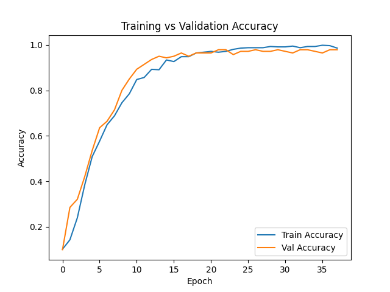
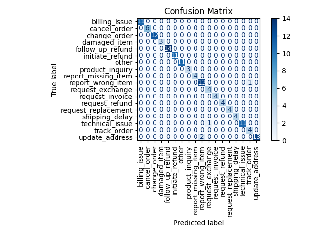
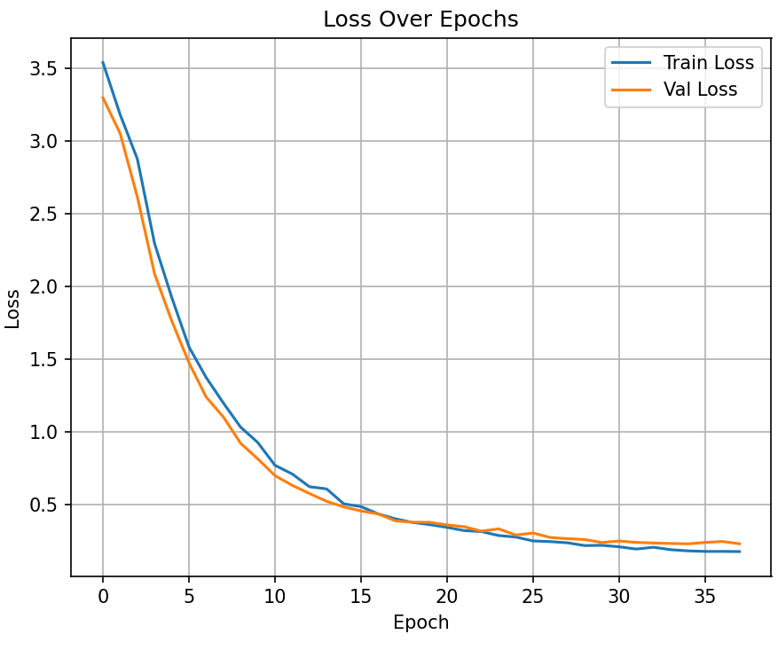

# SmartTextAssistant

An intelligent, end-to-end email assistant that:

* Reads Gmail inbox using the Gmail API
* Uses a trained LSTM model to classify customer intent
* Generates accurate, context-aware responses using OpenAI GPT-3.5
* Automatically replies and labels messages

---

## Demo





---

## Features

* Built with TensorFlow, Keras, OpenAI API, and Gmail API
* Handles intents like `complaint`, `refund_request`, `product_question`, and more
* Auto-detects new unread messages and skips `no-reply` senders
* Tags all replied emails with a custom label `AutoReplied`
* Modular and extensible code

---

## Getting Started

### 1. Clone the repository

```bash
git clone https://github.com/mtbuffum/Customer-Service-Assistant.git
cd Customer-Service-Assistant
```

### 2. Set up your environment

```bash
pip install -r requirements.txt
```

### 3. Add your API Key

Create a `.env` file in the root directory:

```env
OPENAI_API_KEY=your_openai_key_here
```

### 4. Enable Gmail API

* Go to [Google Cloud Console](https://console.cloud.google.com/)
* Create a project and enable the Gmail API
* Download your `credentials.json` into the root directory

On the first run, you'll authenticate in your browser and a `token.json` will be saved.

### 5. Run the assistant

```bash
python src/AutoEmailGenerator.py
```

---

## Directory Structure

```
Customer-Service-Assistant/
├── src/
│   └── AutoEmailGenerator.py     # Main script
├── data/
│   └── Synthetic_Emails.json     # Training data
├── screenshots/                  # Visuals for README
├── .env                          # Contains your OpenAI API key
├── credentials.json              # Gmail API OAuth
├── token.json                    # Gmail API refresh token
├── requirements.txt
├── README.md
├── .gitignore
```

---

## Model Performance

The LSTM model was trained on synthetic email data to predict intent with high accuracy.

* Training Accuracy: \~95%
* Validation Accuracy: \~92%
* Confusion Matrix shows strong performance across all classes

The learning curves indicate healthy convergence without overfitting.

---

## Future Improvements

* Add scheduling and throttling support
* Deploy via Flask or FastAPI as a webhook
* Improve training with real user support tickets
* Add error logging, rate limit detection, and better retry logic

---

## Security

* `.env`, `token.json`, and `credentials.json` are all listed in `.gitignore`
* Keys and tokens should never be committed to source control

---

## Author

**Mason Buffum**
[LinkedIn](https://www.linkedin.com/in/mason-buffum-a3b43a341/) | [GitHub](https://github.com/mtbuffum)

---

## Contact

Have questions or want to collaborate?
**Email:** [mtbuffum@icloud.com](mailto:mtbuffum@icloud.com)

---

## License

This project is open-source under the MIT License.
